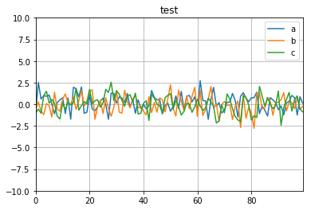
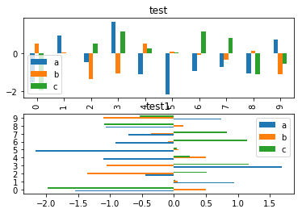

<h1>目录<span class="tocSkip"></span></h1>
<div class="toc"><ul class="toc-item"><li><span><a href="#matplotlib画图简介" data-toc-modified-id="matplotlib画图简介-1"><span class="toc-item-num">1&nbsp;&nbsp;</span>matplotlib画图简介</a></span><ul class="toc-item"><li><span><a href="#概述" data-toc-modified-id="概述-1.1"><span class="toc-item-num">1.1&nbsp;&nbsp;</span>概述</a></span></li><li><span><a href="#细说" data-toc-modified-id="细说-1.2"><span class="toc-item-num">1.2&nbsp;&nbsp;</span>细说</a></span></li></ul></li><li><span><a href="#pandas中绘图函数" data-toc-modified-id="pandas中绘图函数-2"><span class="toc-item-num">2&nbsp;&nbsp;</span>pandas中绘图函数</a></span></li></ul></div>

## matplotlib画图简介

### 概述


```python
# 引包
from matplotlib import pyplot as plt
import numpy as np
```


```python
# 生成一个figure对象
fig = plt.figure()


# fig对象是不能直接画图的, 我们需要得到ax对象

# 2 ,2, 1表示我们有2*2个格子, 现在画第一个
ax1 = fig.add_subplot(2, 2, 1)
ax2 = fig.add_subplot(2, 2, 2)
ax3 = fig.add_subplot(2, 2, 3)

# 默认画在最后定义的一个ax里面
plt.plot(np.random.randn(50).cumsum(), 'b--')

# 画直方图
_ = ax1.hist(np.random.randn(100), bins=20, color='k', alpha=0.5)

# 画散点图
ax2.scatter(np.arange(30), np.random.randn(30))
```


    <matplotlib.collections.PathCollection at 0x21a3fcc3080>


### 细说

关于线图, 线形, 颜色, 点的标记, 都是可以选的:


'-'       solid line style  
'--'      dashed line style  
'-.'      dash-dot line style  
':'       dotted line style  


'.'       point marker  
','       pixel marker  
'o'       circle marker  
'v'       triangle_down marker  
'^'       triangle_up marker  
'<'       triangle_left marker  
'>'       triangle_right marker  
'1'       tri_down marker  
'2'       tri_up marker  
'3'       tri_left marker  
'4'       tri_right marker  
's'       square marker  
'p'       pentagon marker  
'*'       star marker  
'h'       hexagon1 marker  
'H'       hexagon2 marker  
'+'       plus marker  
'x'       x marker  
'D'       diamond marker  
'd'       thin_diamond marker  
'|'       vline marker  
'_'       hline marker  


```python
plt.plot(np.random.randn(50).cumsum(), "k:o")
plt.plot(np.random.randn(50).cumsum(), linestyle='-.', color='gold', marker='*')
plt.plot(np.random.randn(50).cumsum(), linestyle='-.', color='pink', marker='>')
```


    [<matplotlib.lines.Line2D at 0x21a3fc10160>]


设置坐标范围:


```python
plt.xlim([0, 100])
plt.ylim([0, 10])
plt.plot(np.random.randn(50).cumsum(), "k:o")

```


    [<matplotlib.lines.Line2D at 0x21a3fade358>]


设置标题


```python
plt.title("test")
plt.plot(np.random.randn(50).cumsum(), "k:o")
```


    [<matplotlib.lines.Line2D at 0x21a3f620048>]


设置坐标轴显示的数字或者字符


```python
fig = plt.figure()
ax = fig.add_subplot(1, 1, 1)

ax.set_title("test")
ax.set_xticks([0, 5, 10])
ax.set_xticklabels(['one', 'two', 'three'])
ax.plot(np.random.randn(50).cumsum(), "k:o")
```


    [<matplotlib.lines.Line2D at 0x21a41faeda0>]


添加坐标轴说明


```python
fig = plt.figure()
ax = fig.add_subplot(1, 1, 1)

ax.set_title("test")
ax.set_xticks([0, 5, 10])
ax.set_xticklabels(['one', 'two', 'three'], rotation=30)
ax.plot(np.random.randn(50).cumsum(), "k:o")

ax.set_xlabel("x")
ax.set_ylabel("y")
```


    <matplotlib.text.Text at 0x21a41ec12b0>


添加图例


```python
plt.title('best')
plt.xlabel("x")
plt.ylabel("y")

plt.plot(np.random.randn(50).cumsum(), "k:o", label="one")
plt.plot(np.random.randn(50).cumsum(), linestyle='-.', color='gold', marker='*', label="two")
plt.plot(np.random.randn(50).cumsum(), linestyle='-.', color='pink', marker='>', label="three")

plt.legend()
```


    <matplotlib.legend.Legend at 0x21a42135278>


保存图片


```python
plt.title('best')
plt.xlabel("x")
plt.ylabel("y")

plt.plot(np.random.randn(50).cumsum(), "k:o", label="one")
plt.plot(np.random.randn(50).cumsum(), linestyle='-.', color='gold', marker='*', label="two")
plt.plot(np.random.randn(50).cumsum(), linestyle='-.', color='pink', marker='>', label="three")

plt.legend()

plt.savefig('D:/test.png')
```


## pandas中绘图函数

pandas中的绘图函数更加简单:


```python
import pandas as pd
from pandas import Series, DataFrame
```


```python
data = DataFrame(np.random.randn(100, 3), columns=['a', 'b', 'c'])
data.plot(title="test", ylim=[-10, 10], grid=True)
```


    <matplotlib.axes._subplots.AxesSubplot at 0x21a47062ef0>





柱状图


```python
data = DataFrame(np.random.randn(10, 3), columns=['a', 'b', 'c'])
data.plot(title="test", kind='bar')
```


    <matplotlib.axes._subplots.AxesSubplot at 0x21a47c15f60>


```python
fig = plt.figure()
ax1 = fig.add_subplot(2, 1, 1)
ax2 = fig.add_subplot(2, 1, 2)

data = DataFrame(np.random.randn(10, 3), columns=['a', 'b', 'c'])
data.plot(title="test", kind='bar', ax=ax1)
data.plot(title="test1", kind='barh', ax=ax2)

```


    <matplotlib.axes._subplots.AxesSubplot at 0x21a4827d978>





散布图


```python
data = DataFrame(np.random.randn(10000, 3), columns=['a', 'b', 'c'])
pd.plotting.scatter_matrix(data, diagonal='kde', color='k')
```


    array([[<matplotlib.axes._subplots.AxesSubplot object at 0x0000021A4A859DA0>,
            <matplotlib.axes._subplots.AxesSubplot object at 0x0000021A4B972EB8>,
            <matplotlib.axes._subplots.AxesSubplot object at 0x0000021A4B9833C8>],
           [<matplotlib.axes._subplots.AxesSubplot object at 0x0000021A4BA112B0>,
            <matplotlib.axes._subplots.AxesSubplot object at 0x0000021A4BA57630>,
            <matplotlib.axes._subplots.AxesSubplot object at 0x0000021A4BAAD400>],
           [<matplotlib.axes._subplots.AxesSubplot object at 0x0000021A4BAF6630>,
            <matplotlib.axes._subplots.AxesSubplot object at 0x0000021A4BB4FF28>,
            <matplotlib.axes._subplots.AxesSubplot object at 0x0000021A4BB9E8D0>]], dtype=object)


我们可以得到, 每个列都是标准正太分布, 且列于列没有任何关联.
