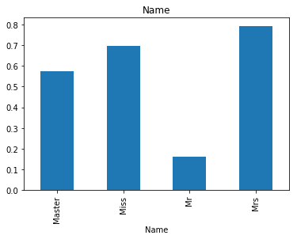

<h1>目录<span class="tocSkip"></span></h1>
<div class="toc"><ul class="toc-item"><li><span><a href="#背景" data-toc-modified-id="背景-1"><span class="toc-item-num">1&nbsp;&nbsp;</span>背景</a></span><ul class="toc-item"><li><span><a href="#问题介绍" data-toc-modified-id="问题介绍-1.1"><span class="toc-item-num">1.1&nbsp;&nbsp;</span>问题介绍</a></span></li><li><span><a href="#特征维度:" data-toc-modified-id="特征维度:-1.2"><span class="toc-item-num">1.2&nbsp;&nbsp;</span>特征维度:</a></span></li></ul></li><li><span><a href="#数据分析" data-toc-modified-id="数据分析-2"><span class="toc-item-num">2&nbsp;&nbsp;</span>数据分析</a></span></li><li><span><a href="#特征处理" data-toc-modified-id="特征处理-3"><span class="toc-item-num">3&nbsp;&nbsp;</span>特征处理</a></span><ul class="toc-item"><li><span><a href="#处理缺失值" data-toc-modified-id="处理缺失值-3.1"><span class="toc-item-num">3.1&nbsp;&nbsp;</span>处理缺失值</a></span></li><li><span><a href="#数据转换" data-toc-modified-id="数据转换-3.2"><span class="toc-item-num">3.2&nbsp;&nbsp;</span>数据转换</a></span></li></ul></li><li><span><a href="#运用算法" data-toc-modified-id="运用算法-4"><span class="toc-item-num">4&nbsp;&nbsp;</span>运用算法</a></span><ul class="toc-item"><li><span><a href="#决策树算法" data-toc-modified-id="决策树算法-4.1"><span class="toc-item-num">4.1&nbsp;&nbsp;</span>决策树算法</a></span></li><li><span><a href="#随机森林" data-toc-modified-id="随机森林-4.2"><span class="toc-item-num">4.2&nbsp;&nbsp;</span>随机森林</a></span></li><li><span><a href="#逻辑回归" data-toc-modified-id="逻辑回归-4.3"><span class="toc-item-num">4.3&nbsp;&nbsp;</span>逻辑回归</a></span></li><li><span><a href="#gbdt" data-toc-modified-id="gbdt-4.4"><span class="toc-item-num">4.4&nbsp;&nbsp;</span>gbdt</a></span></li><li><span><a href="#gbdt-+-LR" data-toc-modified-id="gbdt-+-LR-4.5"><span class="toc-item-num">4.5&nbsp;&nbsp;</span>gbdt + LR</a></span></li><li><span><a href="#把这些模型都融合起来看看呢?" data-toc-modified-id="把这些模型都融合起来看看呢?-4.6"><span class="toc-item-num">4.6&nbsp;&nbsp;</span>把这些模型都融合起来看看呢?</a></span></li></ul></li><li><span><a href="#总结" data-toc-modified-id="总结-5"><span class="toc-item-num">5&nbsp;&nbsp;</span>总结</a></span></li></ul></div>

### 背景

我打算介绍一个kaggle入门级别的Titanic: Machine Learning from Disaster(https://www.kaggle.com/c/titanic), 从这里我们会看到一些做数据分析或者是机器学习的一些小小的蛛丝马迹.

当然这是一个入门的例子, 这个系列我们之后会以问题驱动作为一个主要的模式, 用技术去解决问题, 这是我们的主导思想, 能解决问题的技术, 才是好技术. 当然我会在另外的系列当中介绍一些原理性以及工具性的内容, 其他系列并不是以问题作为导向, 不过我们也会试着以这种风格来旁编写.

#### 问题介绍

The sinking of the RMS Titanic is one of the most infamous shipwrecks in history.  On April 15, 1912, during her maiden voyage, the Titanic sank after colliding with an iceberg, killing 1502 out of 2224 passengers and crew. This sensational tragedy shocked the international community and led to better safety regulations for ships.

One of the reasons that the shipwreck led to such loss of life was that there were not enough lifeboats for the passengers and crew. Although there was some element of luck involved in surviving the sinking, some groups of people were more likely to survive than others, such as women, children, and the upper-class.

In this challenge, we ask you to complete the analysis of what sorts of people were likely to survive. In particular, we ask you to apply the tools of machine learning to predict which passengers survived the tragedy.

简单来说, 就是根据给定的特征, 判断谁死谁没死.

#### 特征维度:

Variable	Definition	Key

survival	Survival	0 = No, 1 = Yes

pclass	Ticket class	1 = 1st, 2 = 2nd, 3 = 3rd

sex	Sex	

Age	Age in years	

sibsp	# of siblings / spouses aboard the Titanic	

parch	# of parents / children aboard the Titanic

ticket	Ticket number	

fare	Passenger fare	

cabin	Cabin number	

embarked	Port of Embarkation	C = Cherbourg, Q = Queenstown, S = Southampton

Name

**对于英文不好的同学, 我来翻译一下:**

survival 是否活着

pclass 买的是什么仓(和坐飞机类似)

sex 性别

Age 年龄

sibsp 兄弟姐妹谁在船上

parch 父母儿女谁在船上

ticket 票的号码

fare 多少钱

cabin 船舱号

embarked 从哪里登船的

Name 名字

下面我们就来看看这个数据长什么样.

### 数据分析

我们分析一下我们的数据


```python
from pandas import Series, DataFrame
import pandas as pd
import numpy as np
```


```python
train = pd.read_csv(r'D:\code\git\docs\数据分析实例\Titanic\train.csv', index_col='PassengerId')
```


```python
train.head(10)
```


<div>
<style>
    .dataframe thead tr:only-child th {
        text-align: right;
    }

    .dataframe thead th {
        text-align: left;
    }

    .dataframe tbody tr th {
        vertical-align: top;
    }
</style>
<table border="1" class="dataframe">
  <thead>
    <tr style="text-align: right;">
      <th></th>
      <th>Survived</th>
      <th>Pclass</th>
      <th>Name</th>
      <th>Sex</th>
      <th>Age</th>
      <th>SibSp</th>
      <th>Parch</th>
      <th>Ticket</th>
      <th>Fare</th>
      <th>Cabin</th>
      <th>Embarked</th>
    </tr>
    <tr>
      <th>PassengerId</th>
      <th></th>
      <th></th>
      <th></th>
      <th></th>
      <th></th>
      <th></th>
      <th></th>
      <th></th>
      <th></th>
      <th></th>
      <th></th>
    </tr>
  </thead>
  <tbody>
    <tr>
      <th>1</th>
      <td>0</td>
      <td>3</td>
      <td>Braund, Mr. Owen Harris</td>
      <td>male</td>
      <td>22.0</td>
      <td>1</td>
      <td>0</td>
      <td>A/5 21171</td>
      <td>7.2500</td>
      <td>NaN</td>
      <td>S</td>
    </tr>
    <tr>
      <th>2</th>
      <td>1</td>
      <td>1</td>
      <td>Cumings, Mrs. John Bradley (Florence Briggs Th...</td>
      <td>female</td>
      <td>38.0</td>
      <td>1</td>
      <td>0</td>
      <td>PC 17599</td>
      <td>71.2833</td>
      <td>C85</td>
      <td>C</td>
    </tr>
    <tr>
      <th>3</th>
      <td>1</td>
      <td>3</td>
      <td>Heikkinen, Miss. Laina</td>
      <td>female</td>
      <td>26.0</td>
      <td>0</td>
      <td>0</td>
      <td>STON/O2. 3101282</td>
      <td>7.9250</td>
      <td>NaN</td>
      <td>S</td>
    </tr>
    <tr>
      <th>4</th>
      <td>1</td>
      <td>1</td>
      <td>Futrelle, Mrs. Jacques Heath (Lily May Peel)</td>
      <td>female</td>
      <td>35.0</td>
      <td>1</td>
      <td>0</td>
      <td>113803</td>
      <td>53.1000</td>
      <td>C123</td>
      <td>S</td>
    </tr>
    <tr>
      <th>5</th>
      <td>0</td>
      <td>3</td>
      <td>Allen, Mr. William Henry</td>
      <td>male</td>
      <td>35.0</td>
      <td>0</td>
      <td>0</td>
      <td>373450</td>
      <td>8.0500</td>
      <td>NaN</td>
      <td>S</td>
    </tr>
    <tr>
      <th>6</th>
      <td>0</td>
      <td>3</td>
      <td>Moran, Mr. James</td>
      <td>male</td>
      <td>NaN</td>
      <td>0</td>
      <td>0</td>
      <td>330877</td>
      <td>8.4583</td>
      <td>NaN</td>
      <td>Q</td>
    </tr>
    <tr>
      <th>7</th>
      <td>0</td>
      <td>1</td>
      <td>McCarthy, Mr. Timothy J</td>
      <td>male</td>
      <td>54.0</td>
      <td>0</td>
      <td>0</td>
      <td>17463</td>
      <td>51.8625</td>
      <td>E46</td>
      <td>S</td>
    </tr>
    <tr>
      <th>8</th>
      <td>0</td>
      <td>3</td>
      <td>Palsson, Master. Gosta Leonard</td>
      <td>male</td>
      <td>2.0</td>
      <td>3</td>
      <td>1</td>
      <td>349909</td>
      <td>21.0750</td>
      <td>NaN</td>
      <td>S</td>
    </tr>
    <tr>
      <th>9</th>
      <td>1</td>
      <td>3</td>
      <td>Johnson, Mrs. Oscar W (Elisabeth Vilhelmina Berg)</td>
      <td>female</td>
      <td>27.0</td>
      <td>0</td>
      <td>2</td>
      <td>347742</td>
      <td>11.1333</td>
      <td>NaN</td>
      <td>S</td>
    </tr>
    <tr>
      <th>10</th>
      <td>1</td>
      <td>2</td>
      <td>Nasser, Mrs. Nicholas (Adele Achem)</td>
      <td>female</td>
      <td>14.0</td>
      <td>1</td>
      <td>0</td>
      <td>237736</td>
      <td>30.0708</td>
      <td>NaN</td>
      <td>C</td>
    </tr>
  </tbody>
</table>
</div>


看我们的数据, 似乎有些值是数字, 有些值是字符串, 有些是缺失值, 我们来看看我们的数据有多少缺失值


```python
train.info()
```

    <class 'pandas.core.frame.DataFrame'>
    Int64Index: 891 entries, 1 to 891
    Data columns (total 11 columns):
    Survived    891 non-null int64
    Pclass      891 non-null int64
    Name        891 non-null object
    Sex         891 non-null object
    Age         714 non-null float64
    SibSp       891 non-null int64
    Parch       891 non-null int64
    Ticket      891 non-null object
    Fare        891 non-null float64
    Cabin       204 non-null object
    Embarked    889 non-null object
    dtypes: float64(2), int64(4), object(5)
    memory usage: 83.5+ KB
    

age和Cabin, Embarked都有缺失值, 下面我们来看的更清楚一些:


```python
total_null = train.isnull().sum()
total = train.isnull().count()
prob =(total_null /  total).map(lambda x: str(round(x * 100, 2)) + '%')
pd.concat([total_null, prob], axis=1)
```


<div>
<style>
    .dataframe thead tr:only-child th {
        text-align: right;
    }

    .dataframe thead th {
        text-align: left;
    }

    .dataframe tbody tr th {
        vertical-align: top;
    }
</style>
<table border="1" class="dataframe">
  <thead>
    <tr style="text-align: right;">
      <th></th>
      <th>0</th>
      <th>1</th>
    </tr>
  </thead>
  <tbody>
    <tr>
      <th>Survived</th>
      <td>0</td>
      <td>0.0%</td>
    </tr>
    <tr>
      <th>Pclass</th>
      <td>0</td>
      <td>0.0%</td>
    </tr>
    <tr>
      <th>Name</th>
      <td>0</td>
      <td>0.0%</td>
    </tr>
    <tr>
      <th>Sex</th>
      <td>0</td>
      <td>0.0%</td>
    </tr>
    <tr>
      <th>Age</th>
      <td>177</td>
      <td>19.87%</td>
    </tr>
    <tr>
      <th>SibSp</th>
      <td>0</td>
      <td>0.0%</td>
    </tr>
    <tr>
      <th>Parch</th>
      <td>0</td>
      <td>0.0%</td>
    </tr>
    <tr>
      <th>Ticket</th>
      <td>0</td>
      <td>0.0%</td>
    </tr>
    <tr>
      <th>Fare</th>
      <td>0</td>
      <td>0.0%</td>
    </tr>
    <tr>
      <th>Cabin</th>
      <td>687</td>
      <td>77.1%</td>
    </tr>
    <tr>
      <th>Embarked</th>
      <td>2</td>
      <td>0.22%</td>
    </tr>
  </tbody>
</table>
</div>


年龄大概有20%的缺失,而Cabin缺失高达77%, Embarked只有两个没有.

我们来看一下特征:


```python
train.columns
```


    Index(['Survived', 'Pclass', 'Name', 'Sex', 'Age', 'SibSp', 'Parch', 'Ticket',
           'Fare', 'Cabin', 'Embarked'],
          dtype='object')


一个一个来看:

**Pclass**


```python
%matplotlib inline

def plotBar(data, x):
    data = data[x + ['Survived']].dropna()
    if len(x) == 1:
        p = data.groupby(x)['Survived'].sum() / data.groupby(x)['Survived'].count()
    else:
        p = data.groupby(x)['Survived'].sum().unstack() / data.groupby(x)['Survived'].count().unstack()
    p.plot(kind='bar', title="+".join(x))
    
plotBar(train, ['Pclass'])
```


我们发现, 1号舱的逃生率高达百分之六十多, 而3号舱不到百分之三十, 所以, 我们得到结论:

**有钱就是好!**

**Sex**


```python
plotBar(train, ['Sex'])
```


女性的存活率远高于男性, 于是我么得到结论:

**做女人挺好!**

**age**

关于年龄, 我们大致上将年龄分为区间:


```python
age = train[["Survived", "Age"]].dropna()
                                 
age.hist(column="Age", bins=30)
```


    array([[<matplotlib.axes._subplots.AxesSubplot object at 0x00000239238976A0>]], dtype=object)


大致上看, 婴孩和中年人得到获救的可能性比较大.

不同年龄的女性和男性有区别吗?


```python
fig = plt.figure()
ax = fig.add_subplot(1, 1, 1)
ax.set_title("male")

age = train[['Sex', 'Age', 'Survived']].dropna()

ax.hist(age[(age["Sex"] == "male") & (age["Survived"] == 0)]['Age'].values, bins=40, label="Not Survived", alpha=0.7)
ax.hist(age[(age["Sex"] == "male") & (age["Survived"] == 1)]['Age'].values, bins=18, label="Survived", alpha=0.7)
ax.legend()
```


    <matplotlib.legend.Legend at 0x2392ecdb160>


```python
fig = plt.figure()
ax = fig.add_subplot(1, 1, 1)
ax.set_title("female")

age = train[['Sex', 'Age', 'Survived']].dropna()

ax.hist(age[(age["Sex"] == "female") & (age["Survived"] == 0)]['Age'].values, bins=40, label="Not Survived", alpha=0.7)
ax.hist(age[(age["Sex"] == "female") & (age["Survived"] == 1)]['Age'].values, bins=18, label="Survived", alpha=0.7)
ax.legend()
```


    <matplotlib.legend.Legend at 0x2392e9c4a90>


对于男性来说, 25-35相对来说活的可能性大, 对于女性来说, 15-40活的可能性大, 婴儿活的可能性都大.

**Embarked**


```python
plotBar(train, ['Embarked'])
```


我们发现, C>Q>S, 所以:

**天时不如地利!**

在危机关头, 多活百分之20也是好的.

我们来看看这个Pclass和Sex之间有没有关系


```python
plotBar(train, ['Pclass', 'Sex'])
```


我们发现, 越是等级高的舱, 对于女性就越是保护:

**有钱的女人挺好!**

我们在来看看登船点和性别有没有关系:


```python
plotBar(train, ['Embarked','Sex'])
```


还是一样, 女性高一些.

kaggle上(https://www.kaggle.com/niklasdonges/end-to-end-project-with-python) 作者画错了一个图, 因此得到了一个错误的结论:


```python
plotBar(train[train['Embarked'] == "C"], ['Pclass','Sex'])
```


我们发现, 作者不知道怎么了, 颜色标反了, 因此结果不正确.


```python
plotBar(train, ['Embarked','Pclass'])
```


我们发现一件有意思的事情, 在Q登陆的, pclass为2的存活概率大.

如果你在Q登船, 请一定要选2等座, 这也许就是天意吧. 所以不要以为有钱就能活, 虽然大致上是这样, 但是还是有一些钱之外的东西左右你的命运.

下面我们来看看这个是有很多家人一起好呢, 还是独自一人好:


```python
data = train.copy()
data['relatives'] = train['SibSp'] +  train['Parch']

plotBar(data, ['relatives'])
```


我们发现, 1, 2, 3个家人最好, 没有家人或者家人大于4个都不行.


```python
plotBar(data, ['relatives', 'Pclass'])
```


这张图说明, 家人数量越多, pclass的差异越小, 当然也有可能是数据不足导致的.

 **Ticket, Fare, Cabin, Name** 
 
 这个3个有什么可以挖的呢, 我们先来看看Ticket:


```python
train[['Ticket']].head(10)
```


<div>
<style>
    .dataframe thead tr:only-child th {
        text-align: right;
    }

    .dataframe thead th {
        text-align: left;
    }

    .dataframe tbody tr th {
        vertical-align: top;
    }
</style>
<table border="1" class="dataframe">
  <thead>
    <tr style="text-align: right;">
      <th></th>
      <th>Ticket</th>
    </tr>
    <tr>
      <th>PassengerId</th>
      <th></th>
    </tr>
  </thead>
  <tbody>
    <tr>
      <th>1</th>
      <td>A/5 21171</td>
    </tr>
    <tr>
      <th>2</th>
      <td>PC 17599</td>
    </tr>
    <tr>
      <th>3</th>
      <td>STON/O2. 3101282</td>
    </tr>
    <tr>
      <th>4</th>
      <td>113803</td>
    </tr>
    <tr>
      <th>5</th>
      <td>373450</td>
    </tr>
    <tr>
      <th>6</th>
      <td>330877</td>
    </tr>
    <tr>
      <th>7</th>
      <td>17463</td>
    </tr>
    <tr>
      <th>8</th>
      <td>349909</td>
    </tr>
    <tr>
      <th>9</th>
      <td>347742</td>
    </tr>
    <tr>
      <th>10</th>
      <td>237736</td>
    </tr>
  </tbody>
</table>
</div>


感觉看不出什么来.


```python
data = train[['Ticket']].copy()

data['ticket_count'] = Series([1] * len(data['Ticket'].values), index=data.index)

count = data.groupby('Ticket').sum().sort_values(by='ticket_count', ascending=False)

data = pd.merge(train, count, left_on="Ticket", right_index=True)[["ticket_count", "Survived"]]

plotBar(data, [ "ticket_count"])
```


似乎我们可以发现, ticket count在2, 3, 4是最好的, 这个也和relatives的结果一样, 可能一家人往往共享票.

Fare这个参数, 应该是有用的吧.


```python
fig = plt.figure()
ax = fig.add_subplot(1, 1, 1)
ax.set_title("Fare")

age = train[['Fare', 'Survived']].dropna()

ax.hist(age[age["Survived"] == 0]['Fare'].values, bins=20, label="Not Survived", alpha=0.7)
ax.hist(age[age["Survived"] == 1]['Fare'].values, bins=20, label="Survived", alpha=0.7)
ax.legend()
```


    <matplotlib.legend.Legend at 0x239361ebd30>


我们可以清晰的看到, 给的钱越多, 活着的比挂了的就要多, 所以:

**一分钱一分货**

Cabin是船上的区域, 缺失值比较多, 但是是不是也是可以利用的呢?


```python
import re

data = train.copy()
data['Cabin'] = train['Cabin'].str.findall('([A-Z]+)', flags=re.IGNORECASE).str[0].fillna('U')

plotBar(data, ['Cabin'])
```


画出这么图的话, 我们似乎可以发现, 没有Cabin信息的, 存活率相对较低, B, D, E最高.

Name这个字段, 原则上应该和谁活不活没有必然的关系, 但是有没有可能, 外国人的名字, 会代表某种身份呢? 比如什么伊丽莎白之类的.

但是名字的话相对来说不是很规范, 因为我对英文的称呼之类的不是很熟悉, 因此是参考的别人的做法, 我们来看看:


```python
data = train.copy()


# 进行字符串的替换
rare_list = ['Dona', 'Lady', 'the Countess','Capt', 'Col', 'Don', 'Dr', 'Major', 'Rev', 'Sir', 'Jonkheer']
data['Name'].str.replace('|'.join(rare_list), "Rare")
data['Name'].str.replace('|'.join(['Mlle', 'Ms']), "Miss")
data['Name'].str.replace('Mme', "Mrs")


# 匹配出我们所要的称谓
pattern = '|'.join(['Master', 'Miss', 'Mrs', 'Mr', 'Rare'])
data['Name'] = data['Name'].str.findall(pattern, re.IGNORECASE).str[0]

print(data.groupby(['Sex', 'Name'])['Survived'].count().unstack().fillna(0))


# 进行画图
plotBar(data, ['Name'])
```

    Name    Master   Miss     Mr    Mrs
    Sex                                
    female     0.0  182.0    0.0  127.0
    male      40.0    0.0  518.0    0.0
    





确实是女性活的几率大, 但是我们不难发现一个很有意思的现象, 男性中, Master的存活可能性很高. 女性中, 已婚女性的可能性更高, 我不知道这个Master是否是学位的称呼, 如果是:

**对于男生来说, 人丑还是应该多读书!**

不过这个master应该不仅仅是学位的意思, 更多的可能是一种身份.

这样, 我们已经把所有的特征数据都分析了一遍, 下面我们来看看怎么处理这些数据.

### 特征处理

#### 处理缺失值

我们发现, 这10个特征我们都可以用, 但是有一个问题, 里面有很多的无效值, 我们需要对这些缺失值进行处理, 看看是填充呢还是扔掉.

数据对于我们来说很宝贵, 如果不是实在没有关联, 我们尽量不要丢弃.

另外, 我们这里的技术是针对小规模数据集的, 对于大规模数据集, 这里的分析技术和机器学习技术是不适用的, 这里我们来说明一下.


```python
train = pd.read_csv(r'D:\code\git\docs\数据分析实例\Titanic\train.csv', index_col='PassengerId')
test =  pd.read_csv(r'D:\code\git\docs\数据分析实例\Titanic\test.csv', index_col='PassengerId')
total = pd.concat([train, test])
```

我们先来看看名字, 对于名字, 里面有个很重要的信息, 就是称呼, 比如Mr, Miss, Mrs, 这些称呼, 对于我们去推断年纪是很有帮助的.


```python
# 进行字符串的替换
names = total['Name']
woman_rare_list = ['Dona', 'Lady', 'the Countess']
man_rare_list = ['Capt', 'Col', 'Don',  'Major', 'Rev', 'Jonkheer']

names = names.str.replace('|'.join(woman_rare_list), "RareWoman")
names = names.str.replace('|'.join(man_rare_list), "RareMan")
names = names.str.replace('|'.join(['Mlle', 'Ms']), "Miss")
names = names.str.replace('Mme', "Mrs")
names = names.str.replace('Sir', "Mr")

names = names.map(lambda x: x.split(',')[1].split('.')[0].strip())
print(names.value_counts())

total['Title'] = names
```

    Mr           758
    Miss         264
    Mrs          198
    Master        61
    RareMan       17
    Dr             8
    RareWoman      3
    Name: Name, dtype: int64
    

我们要注意一个问题, master一般是男孩(网上看到的), 这里没有抓到小女孩的信息, 可能是在Miss里.

我们可以用两个规则来确定小女孩, 年纪小于14的或者是有家人陪同的miss:


```python
def replaceGirl(x):
    if np.isnan(x['Age']) and  x['Title'] == 'Miss' and x['Parch'] > 0:
        return 'Girl'
    
    if x['Age'] < 14 and x['Title'] == 'Miss':
        return 'Girl'
    
    return x['Title']
    

total['Title'] = total.apply(replaceGirl, axis=1)
```


```python
total.groupby('Title')['Age'].median()
```


    Title
    Dr           49.0
    Girl          4.0
    Master        4.0
    Miss         24.0
    Mr           29.0
    Mrs          35.0
    RareMan      47.0
    RareWoman    39.0
    Name: Age, dtype: float64


我们发现, Dr大部分是老头, Mrs是中年妇女, Miss是年轻女孩, Master和Girl是小孩, Mr是青年男人, RareMan都是些有钱老头, RareWoman是贵妇.

我们似乎可以用这些值对年龄进行填充.

用Title各个分组的中值来填充年龄:


```python
null_index = total['Age'].isnull()

total.loc[null_index,'Age'] = total.groupby('Title')['Age'].transform(np.median)[null_index]
```

训练数据集的Age字段就填好了, 测试字段也类似

Embarked字段缺失比较少, 我们可以用做常出现的来作为填充


```python
total.groupby('Embarked')['Age'].count()
```


    Embarked
    C    270
    Q    123
    S    914
    Name: Age, dtype: int64


我们发现最多的是S


```python
total['Embarked'] = total['Embarked'].fillna('S')
```

对于Cabin, 我们用占位变量U来替代NaN:


```python
total['Cabin'] = total['Cabin'].fillna('U')
```


```python
total.info()
```

    <class 'pandas.core.frame.DataFrame'>
    Int64Index: 1309 entries, 1 to 1309
    Data columns (total 12 columns):
    Age         1309 non-null float64
    Cabin       1309 non-null object
    Embarked    1309 non-null object
    Fare        1308 non-null float64
    Name        1309 non-null object
    Parch       1309 non-null int64
    Pclass      1309 non-null int64
    Sex         1309 non-null object
    SibSp       1309 non-null int64
    Survived    891 non-null float64
    Ticket      1309 non-null object
    Title       1309 non-null object
    dtypes: float64(3), int64(3), object(6)
    memory usage: 172.9+ KB
    

我们发现, 测试集的Fare还有个缺失值:


```python
total['Fare'] = total['Fare'].fillna(0)
```

好了, 我们缺失值都已经填补好了, 下面我们要对数据进行转换.

#### 数据转换


```python
total.info()
```

    <class 'pandas.core.frame.DataFrame'>
    Int64Index: 1309 entries, 1 to 1309
    Data columns (total 12 columns):
    Age         1309 non-null float64
    Cabin       1309 non-null object
    Embarked    1309 non-null object
    Fare        1309 non-null float64
    Name        1309 non-null object
    Parch       1309 non-null int64
    Pclass      1309 non-null int64
    Sex         1309 non-null object
    SibSp       1309 non-null int64
    Survived    891 non-null float64
    Ticket      1309 non-null object
    Title       1309 non-null object
    dtypes: float64(3), int64(3), object(6)
    memory usage: 172.9+ KB
    

现在我们数据都已经填补好了, 但是很多数据都不是数值, 都是符号, 这样计算机是没有办法识别的, 我们需要对数据进行转换.


```python
train.columns
```


    Index(['Survived', 'Pclass', 'Name', 'Sex', 'Age', 'SibSp', 'Parch', 'Ticket',
           'Fare', 'Cabin', 'Embarked'],
          dtype='object')


Name

因为已经有Title了, Name我就不要了


```python
total = total.drop('Name', axis=1)
total.columns
```


    Index(['Age', 'Cabin', 'Embarked', 'Fare', 'Parch', 'Pclass', 'Sex', 'SibSp',
           'Survived', 'Ticket', 'Title'],
          dtype='object')


SibSp, Parch合并起来, 可以增加一个新的字段:


```python
total['relatives'] = total['SibSp'] + total['Parch']
```

Ticket可以替换成每个人共享的ticket num


```python
data = total['Ticket']
data = DataFrame(data.value_counts()).rename(columns={'Ticket':'TicketCount'})

total = pd.merge(total, data, left_on='Ticket', right_index=True)
total = total.drop('Ticket', axis=1)
```


```python
total.columns
```


    Index(['Age', 'Cabin', 'Embarked', 'Fare', 'Parch', 'Pclass', 'Sex', 'SibSp',
           'Survived', 'Title', 'relatives', 'TicketCount'],
          dtype='object')


Cabin

我们要提取出Carbin的类别值:


```python
total['Cabin'] = total['Cabin'].str.findall('([A-Z]+)', flags=re.IGNORECASE).str[0].fillna('U')
```

将所有分类都变成onehot的:


```python
labels = ['Pclass', 'Title', 'Sex', 'Cabin', 'Embarked']

for x in labels:
    total = total.join(pd.get_dummies(total[x]), lsuffix='_x', rsuffix='_y')
    total = total.drop(x, axis=1)
```

保存:


```python
train = total.loc[train.index]
test = total.loc[test.index].drop('Survived', axis=1)

train.to_csv(r'D:\code\git\docs\数据分析实例\Titanic\train_dealed.csv')
test.to_csv(r'D:\code\git\docs\数据分析实例\Titanic\test_dealed.csv')
```

### 运用算法

我们这里将会使用算法来处理这些数据.

#### 决策树算法


```python
from sklearn import tree, cross_validation
from sklearn.model_selection import GridSearchCV

clf = tree.DecisionTreeClassifier(max_depth=5, min_samples_split=10)
X = train.copy().drop(['Survived'], axis=1)
Y = train.copy()['Survived']

scores = cross_validation.cross_val_score(clf, X, Y, cv=5)
print(np.mean(scores))
```

    0.817172502746
    

我们看到, 决策树大概只有81%的准确率.

决策树有一些参数, 我们可以用GridSearch的方式来决定哪一组参数好.


```python
import numpy as np
from sklearn.tree import DecisionTreeClassifier
from sklearn.model_selection import GridSearchCV

param_grid = {"criterion" : ["gini", "entropy"], "min_samples_leaf" : np.arange(1, 11, 2), "min_samples_split" : np.arange(2, 11, 2), "max_depth": np.arange(1, 21, 2)}

clf = DecisionTreeClassifier()

clf = GridSearchCV(estimator=clf, param_grid=param_grid, n_jobs=-1, cv=5)

clf.fit(X, Y)

clf.best_params_
```


    {'criterion': 'entropy',
     'max_depth': 3,
     'min_samples_leaf': 1,
     'min_samples_split': 2}


```python
clf = tree.DecisionTreeClassifier(criterion='entropy',max_depth=3, min_samples_leaf=1, min_samples_split=2)
clf.fit(X, Y)

ans = DataFrame(clf.predict(test), index=test.index, columns=['Survived'], dtype=np.int32)
ans.to_csv(r'D:\code\git\docs\数据分析实例\Titanic\决策树.csv', header=True)
```

kagge上是79%, 凑合.

#### 随机森林


```python
from sklearn.ensemble import RandomForestClassifier

clf = RandomForestClassifier()

scores = cross_validation.cross_val_score(clf, X, Y, cv=5)

print(np.mean(scores))
```

    0.805917290916
    

用gridsearch确定参数


```python
param_grid = {"n_estimators":np.arange(10, 51, 10), "criterion" : ["gini", "entropy"], "min_samples_leaf" : np.arange(1, 11, 2), "min_samples_split" : np.arange(2, 11, 2), "max_depth": np.arange(1, 21, 2)}

clf = RandomForestClassifier()

clf = GridSearchCV(estimator=clf, param_grid=param_grid, n_jobs=-1, cv=5)

clf.fit(X, Y)

clf.best_params_
```


    {'criterion': 'entropy',
     'max_depth': 17,
     'min_samples_leaf': 3,
     'min_samples_split': 2,
     'n_estimators': 20}


```python
clf = RandomForestClassifier(criterion='entropy', max_depth=17, min_samples_leaf=3, min_samples_split=2, n_estimators=20)

clf.fit(X_new, Y_new)

ans = DataFrame(clf.predict(test), index=test.index, columns=['Survived'], dtype=np.int32)
ans.to_csv(r'D:\code\git\docs\数据分析实例\Titanic\随机森林.csv', header=True)
```

在kaggle上表现为76%.

#### 逻辑回归

这个玩意儿可是机器学习的看家法宝, 好用的很.


```python
from sklearn.linear_model import LogisticRegression
lr = LogisticRegression(C=1000.0, max_iter=10000)

lr.fit(X, Y)
scores = cross_validation.cross_val_score(lr, X, Y, cv=5)
print(np.mean(scores))
```

    0.819362987346
    

注意到, 这里的C是正则化系数的倒数, 可以找一个最好的C


```python
param_grid = {'C':[10, 100, 1000, 10000]}

lr = LogisticRegression(max_iter=10000)

clf = GridSearchCV(estimator=lr, param_grid=param_grid, n_jobs=-1, cv=5)

clf.fit(X, Y)

clf.best_params_
```


    {'C': 10}


```python
lr = LogisticRegression(max_iter=10000, C=10)
lr.fit(X, Y)

scores = cross_validation.cross_val_score(lr, X, Y, cv=5)
print(np.mean(scores))

ans = DataFrame(clf.predict(test), index=test.index, columns=['Survived'], dtype=np.int32)
ans.to_csv(r'D:\code\git\docs\数据分析实例\Titanic\逻辑回归.csv', header=True)
```

    0.819362987346
    

kaggle上76%.

#### gbdt

拿出压箱底的绝技, GBDT, 看看效果怎么样

我们发现之前的效果都不好, 怎么办呢, 干脆把年龄也做成类标签


```python
total_bak = total.copy()
```


```python
total = total_bak.copy()
total['Age'] = pd.cut(total['Age'], [0, 14,1000])
```


```python
total = total.join(pd.get_dummies(total['Age']).rename(columns=str)).drop('Age', axis=1)
```


```python
X = total.loc[train.index].drop('Survived', axis=1)
Y = total.loc[train.index]['Survived']

test = total.loc[test.index].drop('Survived', axis=1)
```


```python
data = X.copy()
label = Y.copy()

for i in range(200):
    x = np.random.randint(0, len(X.index))
    data = pd.concat([data, X.iloc[[x]]], axis=0, ignore_index=True)
    label = pd.concat([label, Y.iloc[[x]]], axis=0, ignore_index=True)

```


```python
from sklearn.ensemble import GradientBoostingClassifier

clf = GradientBoostingClassifier(n_estimators=20)

scores = cross_validation.cross_val_score(clf, data, label, cv=5)

print(np.mean(scores))
```

    0.831346308991
    

感觉还不错, 我们继续看能不能调参到最好:


```python
clf = GradientBoostingClassifier()

param_grid = {"loss": ['deviance', 'exponential'], "learning_rate":[0.08, 0.1, 0.12], "n_estimators":[10, 20, 30, 40, 50], "min_samples_leaf": np.arange(1, 9, 2), "min_samples_split":np.arange(2, 11, 2), "max_depth": np.arange(2, 7, 2)}

clf = GridSearchCV(estimator=clf, param_grid=param_grid, n_jobs=-1, cv=5)

clf.fit(data, label)

clf.best_params_
```


    {'learning_rate': 0.12,
     'loss': 'deviance',
     'max_depth': 6,
     'min_samples_leaf': 3,
     'min_samples_split': 2,
     'n_estimators': 50}


```python
clf = GradientBoostingClassifier(learning_rate=0.12, loss='exponential', n_estimators=50, max_depth=6, min_samples_leaf=3, min_samples_split=2)

scores = cross_validation.cross_val_score(clf, X, Y, cv=5)
print(np.mean(scores))
```

    0.828357957534
    


```python
clf = GradientBoostingClassifier(learning_rate=0.12, loss='exponential', n_estimators=20, max_depth=6, min_samples_leaf=5, min_samples_split=2)
clf.fit(data, label)

ans = DataFrame(clf.predict(test), index=test.index, columns=['Survived'], dtype=np.int32)
ans.to_csv(r'D:\code\git\docs\数据分析实例\Titanic\gbdt.csv', header=True)
```

居然有83%, kaggle上是81%, 大概是500多名的样子. 凑合!

#### gbdt + LR 


```python
point = int(len(X.index)/ 5 * 4)
X_train = X.loc[:point]
Y_train = Y.loc[:point]

X_test = X.loc[point:]
Y_test = Y.loc[point:]


clf = GradientBoostingClassifier(learning_rate=0.12, loss='exponential', n_estimators=50, max_depth=6, min_samples_leaf=3, min_samples_split=2)
clf.fit(X_train, Y_train)

features = DataFrame(clf.apply(total.drop('Survived', axis=1)).squeeze(), dtype=np.int64, index=total.index)

tmp = []
for x in features.columns:
    tmp.append(pd.get_dummies(features[x]))
combine_features = pd.concat(tmp, axis=1, ignore_index=True)

final_features = pd.concat([total.drop('Survived', axis=1), combine_features], axis=1, ignore_index=True)
train_feature = final_features.loc[X_train.index]

lr = LogisticRegression(max_iter=1000, C=10)
lr.fit(train_feature, Y_train)

scores = lr.score(final_features.loc[X_test.index], Y_test)
print(scores)
```

    0.816666666667
    

准确率到82%


```python
clf = GradientBoostingClassifier(learning_rate=0.12, loss='exponential', n_estimators=20, max_depth=6, min_samples_leaf=5, min_samples_split=2)
clf.fit(X, Y)

features = DataFrame(clf.apply(total.drop('Survived', axis=1)).squeeze(), dtype=np.int64, index=total.index)

tmp = []
for x in features.columns:
    tmp.append(pd.get_dummies(features[x]))
combine_features = pd.concat(tmp, axis=1, ignore_index=True)

final_features = pd.concat([total.drop('Survived', axis=1), combine_features], axis=1, ignore_index=True)
train_feature = combine_features.loc[train.index]
lr = LogisticRegression(max_iter=10000, C=10)
lr.fit(train_feature, Y)

test_features = combine_features.loc[test.index]

ans = DataFrame(lr.predict(test_features), index=test.index, columns=['Survived'], dtype=np.int32)
ans.to_csv(r'D:\code\git\docs\数据分析实例\Titanic\GBDT_LR.csv', header=True)
```

kaggle上75%,

#### 把这些模型都融合起来看看呢?


```python
model1 =  pd.read_csv(r'D:\code\git\docs\数据分析实例\Titanic\决策树.csv', index_col='PassengerId')
model2 = pd.read_csv(r'D:\code\git\docs\数据分析实例\Titanic\随机森林.csv', index_col='PassengerId')
model3 = pd.read_csv(r'D:\code\git\docs\数据分析实例\Titanic\逻辑回归.csv', index_col='PassengerId')
model4 = pd.read_csv(r'D:\code\git\docs\数据分析实例\Titanic\gbdt.csv', index_col='PassengerId')
model5 = pd.read_csv(r'D:\code\git\docs\数据分析实例\Titanic\GBDT_LR.csv', index_col='PassengerId')

model = model1 + model2 + model3 + model4 + model5

def average(x):
    if x >= 3:
        return 1
    else:
        return 0

model.applymap(average).to_csv(r'D:\code\git\docs\数据分析实例\Titanic\combine.csv', header=True)
```

kaggle上是80%

总结起来, 在这个问题上, GBDT效果相对最理想, 并且我们之前用过没有复制样本的版本, 准确率是77%, 所以复制样本集合提高了我们的准确率.

### 总结

我们在kaggle titanic这个问题上, 展示了怎么用机器学习技术解决一些数据问题, 这个只是一个演示, 这个问题在Kaggle上有将近10000只队伍参加, 我们最后的成绩也还行,进入前6%, 如果要继续搞, 可能就会有很多的特殊的技巧, 并不具有通用性. 大家可以看看整个流程.    
